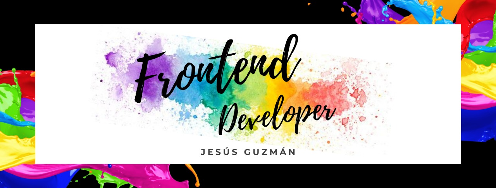

 

# Greetings 

## About me

My name is Jesús Guzmán i am <i>Front-End Developer </i> but my goal is to be <i>Full-Stack Developer</i>. I like to share my knowledge and help those who need it. By the way i am also an animal lover :heart:

Some of my hobbies are basketball, swimming, video games, watching movies (specially action-science fiction films) and anime series.

## :chart_with_upwards_trend: GitHub Stats

## :toolbox: Tech Tools

  
  
  
  
  
  
  
  
  
  
  
  
  
  
  
  
  
  
  
  
  
  
  
  
  
  
  
  
  
  
  
  
  
  
  
  
  
  

## :mortar_board: Courses & License

**_Bachelor's Degree: Computer Science_**

**_Professional License: 12494550_**

**_Udemy:_**

<ul style="list-style-image: url(./assets/estrella.png);list-style-position: outside;">
  <li>
    <a href="https://www.udemy.com/certificate/UC-d086cc2c-5b25-4c85-9bbc-e085c9462fc7/" style="color:#628FDA;text-decoration: underline;">JavaScript</a>
  </li>
  <li>
    <a href="https://www.udemy.com/certificate/UC-c7960f2e-fcdb-4170-9a5f-16d7c060893b/" style="color:#628FDA;text-decoration: underline;">TypeScript</a>
  </li>
  <li>
    <a href="https://www.udemy.com/certificate/UC-65cc07ff-c152-4339-b3c3-9816732860d7/" style="color:#628FDA;text-decoration: underline;">ReactJS</a>
  </li>
  <li>
    <a href="https://www.udemy.com/certificate/UC-7f001521-1ffb-430c-b3cd-5a44c5ddcfb2/" style="color:#628FDA;text-decoration: underline;">NextJS</a>
  </li>
  <li>
    <a href="https://www.udemy.com/certificate/UC-ec6d33d1-dbe9-469e-93ed-fd4c2fdd55ca/" style="color:#628FDA;text-decoration: underline;">Data Structures + Algorithms</a>
  </li>
</ul>

## 😄 Social Media

